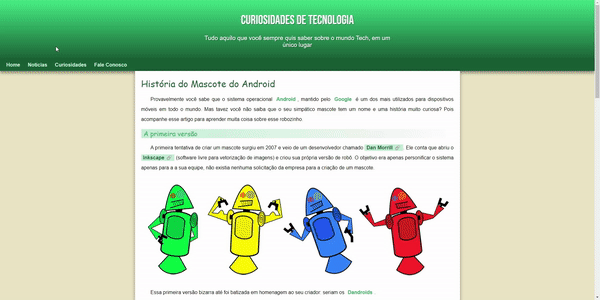

# Android Site

This is a one-page website project about the history of Android, created based on the free course from Curso em Vídeo, taught by Professor Gustavo Guanabara.

## Table of Contents
- <a href="#description">Description</a>
- <a href="#tools-used">Tools Used</a>
- <a href="#layout-preview">Layout Preview</a>
- <a href="#usage-instructions">Usage Instructions</a>
- <a href="#deployment">Deployment</a>
- <a href="#contact">Contact</a>

## Description

The purpose of this project is to provide an informative and interactive website about the history of Android and also learn about HTML and CSS in the process. The site was developed as a one-page layout, where users can explore different aspects of the operating system, including news and curiosities.

## Tools Used 

- <a href="https://developer.mozilla.org/pt-BR/docs/Web/HTML" target="_blank">HTML5</a>
- <a href="https://developer.mozilla.org/pt-BR/docs/Web/CSS" target="_blank">CSS3</a>

## Layout preview
You can also watch those short previews of how it looks either on desktop or mobile version:

### Desktop

### Mobile

## Usage Instructions
To use the project locally, follow the instructions below:

- Clone this repository to your local machine.
- Open the **index.html** file in a web browser.

## Deployment
The project is deployed using GitHub Pages. You can access it by clicking the link below:

<a href="https://wesleysantosdev.github.io/android-site/" target="_blank">Android Site Deployment</a>

## Contact
If you have any suggestions for this project, feel free to contact me:

- Name: Wesley Santos
- Email: wesleysantosdev@outlook.com
- GitHub: @wesleysantosdev

I hope you enjoy this project and find interesting information about the history of Android!